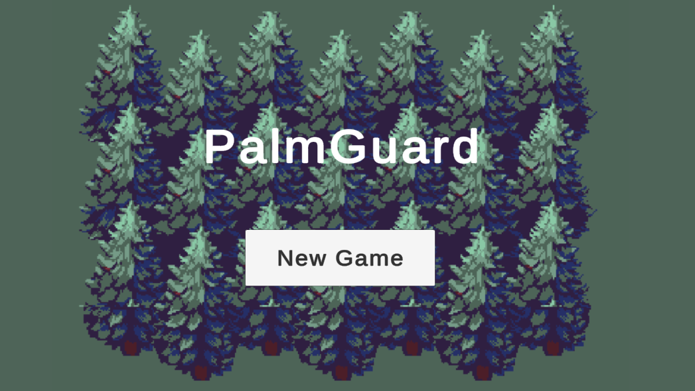
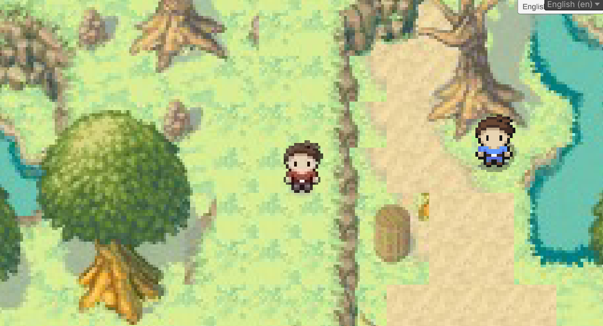
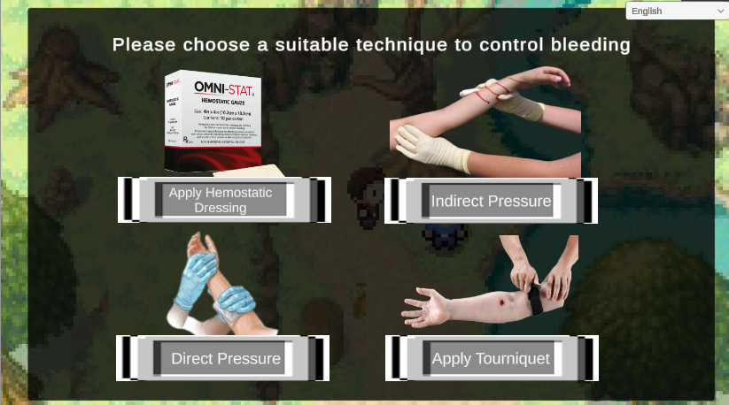
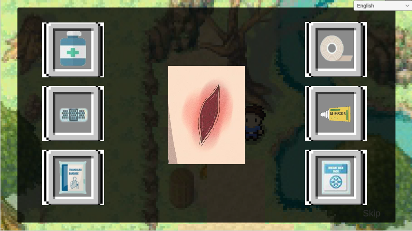
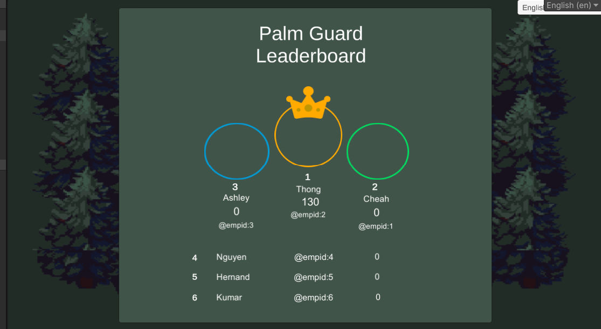

# 🌴 Palm Guard: The Ultimate RPG Adventure 🗡️

Welcome to the heart of our epic RPG adventure, powered by Unity! 🎮✨

## Overview

Ever dreamt of embarking on an exhilarating journey through mystical realms and vanquishing formidable foes? Look no further! Our Unity-powered RPG game, **"Palm Guard,"** promises an immersive experience that will whisk you away to realms unknown. 🏰🔮

## Features
1. 🎮 **Decisional-based RPG Gameplay**: Engage in an immersive RPG experience where your decisions impact the storyline and outcomes. Navigate through various challenges and quests, making strategic choices that shape your adventure.
2. 🌐 **Automated Multi-language Support**: The game supports localization for up to 5 different languages, ensuring a broad reach and inclusive gameplay experience. This feature is powered by the Google Sheets API, allowing for seamless translation updates and management.
3. 🏆 **Leaderboard Functionality**: Compete with other players and track your progress with our integrated leaderboard system. Using SQLite as the database, the leaderboard records and displays top scores, fostering a competitive environment and enhancing replayability.

## Getting Started

Ready to embark on this epic quest? Follow these steps to dive into the adventure:

1. **Clone the Repository**
2. **Install Unity**: Download and install the latest version of Unity from [here](https://unity.com/). 🛠️
3. **Setup SQLite**: Download SQLite and open PalmGuard.db 🔧

<table>
  <tr>
    <td></td>
    <td></td>
    <td></td>
  </tr>
  <tr>
    <td></td>
    <td></td>
    <td></td>
  </tr>
</table>

